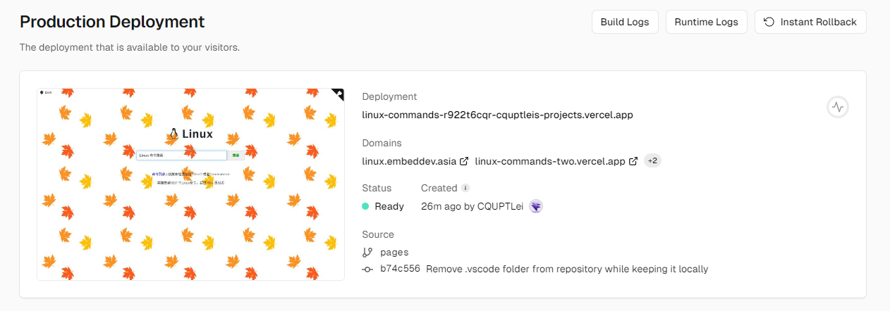

<p align="center">
  <a href="https://github.com/CQUPTLei/linux-commands">
    
  </a>
  <h1>Linux Command</h1>
</p>
[](https://jaywcjlove.github.io/#/sponsor)
[](https://github.com/jaywcjlove/linux-command/actions/workflows/ci.yml)
[](https://jaywcjlove.github.io/linux-command/)
[](http://weibo.com/pc175)
[](https://www.npmjs.com/package/linux-command)
[](https://www.jsdelivr.com/package/npm/linux-command)
[](https://hub.docker.com/r/wcjiang/linux-command)

当前仓库搜集了 `580` 多个 Linux 命令，是一个非盈利性的仓库，生成了一个 web 网站方便使用，目前网站没有任何广告，内容包含 Linux 命令手册、详解、学习，内容来自网络和网友的补充，非常值得收藏的 Linux 命令速查手册。版权归属原作者，对任何法律问题及风险不承担任何责任，没有任何商业目的，如果认为侵犯了您的版权，请来信告知。我不能完全保证内容的正确性。通过使用本站内容带来的风险与我无关。当使用本站时，代表您已接受了本站的使用条款和隐私条款。

## Web 版本

预览搜索：**https://git.io/linux**

[](https://jaywcjlove.github.io/linux-command/)

你可以随意部署 web 版，这非常简单，只需要克隆 [`gh-pages`](https://github.com/jaywcjlove/linux-command/tree/gh-pages) 分支代码到你的静态服务就可以了。你也可以将 [`command`](https://github.com/jaywcjlove/linux-command/tree/master/command) 目录中的 Markdown 文件拿去自己生成 HTML。还可以使用下方 docker 方法部署 web 版。

⚠️ 你们拿过去部署的静态网站，还是希望挂个 GitHub 地址，这样大家共同维护命令文档，让文档更加完善，更加丰富，当然你删除本站所有信息相关信息，其实我也不太在意，默认允许你们随意搞，我不负任何负责。如果您也部署了一份，可以将网址放到下面 😊。

## Docker

[](https://hub.docker.com/r/wcjiang/linux-command) [](https://hub.docker.com/r/wcjiang/linux-command) [](https://hub.docker.com/r/wcjiang/linux-command)

轻松通过 docker 部署 linux-command 网站。

```bash
docker pull wcjiang/linux-command
# Or
docker pull ghcr.io/jaywcjlove/linux-command:latest
```

```bash
docker run --name linux-command --rm -d -p 9665:3000 wcjiang/linux-command:latest
# Or
docker run --name linux-command -itd -p 9665:3000 wcjiang/linux-command:latest
# Or
docker run --name linux-command -itd -p 9665:3000 ghcr.io/jaywcjlove/linux-command:latest
```

在浏览器中访问以下 URL

```bash
http://localhost:9665/
```

## Vercel

可以点击下面按钮一键部署至 [Vercel](https://vercel.com):

[](https://vercel.com/new/clone?repository-url=https://github.com/jaywcjlove/linux-command)

<details>
<summary>部署结果</summary>



</details>

通过 Vercel 分配的域名访问，或者自行在设置中绑定域名。

## Linux命令分类

*这里存放Linux 命令大全并不全，你可以通过[linux-command](https://jaywcjlove.github.io/linux-command/)来搜索，它是把 [command](./assets/command) 目录里面搜集的命令，生成了静态HTML并提供预览以及索引搜索。*

### 文件传输

bye、ftp、ftpcount、ftpshut、ftpwho、ncftp、tftp、uucico、uucp、uupick、uuto、scp

### 备份压缩

ar、bunzip2、bzip2、bzip2recover、compress、cpio、dump、gunzip、gzexe、gzip、lha、restore、tar、unarj、unzip、zip、zipinfo

### 文件管理

diff、diffstat、file、find、git、gitview、ln、locate、lsattr、mattrib、mc、mcopy、mdel、mdir、mktemp、mmove、mread、mren、mshowfat、mtools、mtoolstest、mv、od、paste、patch、rcp、rhmask、rm、slocate、split、tee、tmpwatch、touch、umask、whereis、which、cat、chattr、chgrp、chmod、chown、cksum、cmp、cp、cut、indent

### 磁盘管理

cd、df、dirs、du、edquota、eject、lndir、ls、mcd、mdeltree、mdu、mkdir、mlabel、mmd、mmount、mrd、mzip、pwd、quota、quotacheck、quotaoff、quotaon、repquota、rmdir、rmt、stat、tree、umount

### 磁盘维护

badblocks、cfdisk、dd、e2fsck、ext2ed、fdisk、fsck.ext2、fsck、fsck.minix、fsconf、hdparm、losetup、mbadblocks、mformat、mkbootdisk、mkdosfs、mke2fs、mkfs.ext2、mkfs、mkfs.minix、mkfs.msdos、mkinitrd、mkisofs、mkswap、mpartition、sfdisk、swapoff、swapon、symlinks、sync

### 系统设置

alias、apmd、aumix、bind、chkconfig、chroot、clock、crontab、declare、depmod、dircolors、dmesg、enable、eval、export、fbset、grpconv、grpunconv、hwclock、insmod、kbdconfig、lilo、liloconfig、lsmod、minfo、mkkickstart、modinfo、modprobe、mouseconfig、ntsysv、passwd、pwconv、pwunconv、rdate、resize、rmmod、rpm、set、setconsole、setenv、setup、sndconfig、SVGAText Mode、timeconfig、ulimit、unalias、unset

### 系统管理

adduser、chfn、chsh、date、exit、finger、free、fwhois、gitps、groupdel、groupmod、halt、id、kill、last、lastb、login、logname、logout、logrotate、newgrp、nice、procinfo、ps、pstree、reboot、renice、rlogin、rsh、rwho、screen、shutdown、sliplogin、su、sudo、suspend、swatch、tload、top、uname、useradd、userconf、userdel、usermod、vlock、w、who、whoami、whois

### 文本处理

awk、col、colrm、comm、csplit、ed、egrep、ex、fgrep、fmt、fold、grep、ispell、jed、joe、join、look、mtype、pico、rgrep、sed、sort、spell、tr、uniq、vi、wc

### 网络通讯

dip、getty、mingetty、ppp-off、smbd(samba daemon)、telnet、uulog、uustat、uux、cu、dnsconf、efax、httpd、ip、ifconfig、mesg、minicom、nc、netconf、netconfig、netstat、ping、ping6、pppstats、samba、setserial、shapecfg(shaper configuration)、smbd(samba daemon)、statserial(status ofserial port)、talk、tcpdump、testparm(test parameter)、traceroute、tty(teletypewriter)、uuname、wall(write all)、write、ytalk、arpwatch、apachectl、smbclient(samba client)、pppsetup

### 设备管理

dumpkeys、loadkeys、MAKEDEV、rdev、setleds

### 电子邮件与新闻组

archive、ctlinnd、elm、getlist、inncheck、mail、mailconf、mailq、messages、metamail、mutt、nntpget、pine、slrn、X WINDOWS SYSTEM、reconfig、startx(start X Window)、Xconfigurator、XF86Setup、xlsatoms、xlsclients、xlsfonts

### 其他命令

yes


## 开发使用

可以通过 `npm` 安装 [`linux-command`](https://www.npmjs.com/package/linux-command) 包，包含所有命令的 markdown 文本，和一个[索引文件](dist/data.json)。

```bash
npm install linux-command
```

```js
var comm = require("linux-command");
console.log("---->", comm.ls);

var alias = require("linux-command/command/alias.md");
console.log("---->", alias); // markdown string
```

你也可以通过 CDN 来访问索引数据，和对应的命令详细内容，我将更新内容定期发布版本，提供大家使用，[UNPKG](https://unpkg.com/linux-command/) 带上版本号，将锁定版本访问，删除版本号请求数据，将会自动重定向最新版本。

```shell
# 命令索引 JSON 数据
https://unpkg.com/linux-command/dist/data.json
# 对应命令详情（Markdown）数据
https://unpkg.com/linux-command/command/<命令名称>.md
```

你也可以通过 Github 的 Raw 来，获取最新的内容

```shell
# 命令索引 JSON 数据
https://raw.githubusercontent.com/jaywcjlove/linux-command/master/dist/data.json
# 对应命令详情（Markdown）数据
https://raw.githubusercontent.com/jaywcjlove/linux-command/master/command/<命令名称>.md 
```

## Linux学习资源整理


### 社区网站

- [Linux中国](https://linux.cn/) - 各种资讯、文章、技术
- [实验楼](https://www.shiyanlou.com/) - 免费提供了Linux在线环境，不用在自己机子上装系统也可以学习Linux，超方便实用。
- [鸟哥的linux私房菜](http://linux.vbird.org/) - 非常适合Linux入门初学者看的教程。
- [Linux公社](http://www.linuxidc.com/) - Linux相关的新闻、教程、主题、壁纸都有。
- [Linux Today](http://www.linuxde.net) - Linux新闻资讯发布，Linux职业技术学习！。
- [X-CMD](https://www.x-cmd.com/) - Shell + AWK 为核心增强原生命令输出以及交互体验，各种命令以及现代化软件包的介绍和使用教程，每日科技新闻资讯，欢迎浏览关注！

### 知识相关

- [Linux思维导图整理](http://www.jianshu.com/p/59f759207862)
- [Linux初学者进阶学习资源整理](http://www.jianshu.com/p/fe2a790b41eb)
- [Linux 基础入门（新版）](https://www.shiyanlou.com/courses/1)
- [【译】Linux概念架构的理解](http://www.jianshu.com/p/c5ae8f061cfe) [En](http://oss.org.cn/ossdocs/linux/kernel/a1/index.html)
- [Linux 守护进程的启动方法](http://www.ruanyifeng.com/blog/2016/02/linux-daemon.html)
- [Linux编程之内存映射](https://www.shiyanlou.com/questions/2992)
- [Linux知识点小结](https://blog.huachao.me/2016/1/Linux%E7%9F%A5%E8%AF%86%E7%82%B9%E5%B0%8F%E7%BB%93/)
- [10大白帽黑客专用的 Linux 操作系统](https://linux.cn/article-6971-1.html)

### 软件工具

- [超赞的Linux软件](https://www.gitbook.com/book/alim0x/awesome-linux-software-zh_cn/details) Github仓库[Zh](https://github.com/alim0x/Awesome-Linux-Software-zh_CN) [En](https://github.com/VoLuong/Awesome-Linux-Software)

Adobe软件的最佳替代品 [原文在这里](https://linux.cn/article-8928-1.html)

- [Evince (Adobe Acrobat Reader)](https://wiki.gnome.org/Apps/Evince) 一个“支持多种文档格式的文档查看器”，可以查看PDF，还支持各种漫画书格式
- [Pixlr (Adobe Photoshop)](https://pixlr.com/) 一个强大的图像编辑工具
- [Inkscape (Adobe Illustrator)](https://inkscape.org/zh/) 一个专业的矢量图形编辑器
- [Pinegrow Web Editor (Adobe Dreamweaver)](https://pinegrow.com/) 一个可视化编辑制作 HTML 网站
- [Scribus (Adobe InDesign)](https://www.scribus.net/) 一个开源电子杂志制作软件
- [Webflow (Adobe Muse)](https://webflow.com/) 一款可以帮助用户不用编码就可以快速创建网站的谷歌浏览器插件。
- [Tupi (Adobe Animate)](http://www.maefloresta.com/portal/) 一款可以创建HTML5动画的工具。
- [Black Magic Fusion (Adobe After Effects)](https://www.blackmagicdesign.com) 一款先进的合成软件，广泛应用于视觉特效、广电影视设计以及3D动画设计等领域。

### 中国开源镜像站点

- 阿里云开源镜像站：http://mirrors.aliyun.com/
- 网易开源镜像站：http://mirrors.163.com/
- 搜狐开源镜像站：http://mirrors.sohu.com/
- 北京交通大学：http://mirror.bjtu.edu.cn/ \<教育网荐\>
- 兰州大学：http://mirror.lzu.edu.cn/ \<西北高校FTP搜索引擎\>
- 上海交通大学：http://ftp.sjtu.edu.cn/
- 清华大学：http://mirrors.tuna.tsinghua.edu.cn/
  - http://mirrors4.tuna.tsinghua.edu.cn/
- 中国科学技术大学：http://mirrors.ustc.edu.cn/ 
  - http://ipv6.ustc.edu.cn/ \<IPv6 only\>
- 东北大学：http://mirror.neu.edu.cn/
- 浙江大学：http://mirrors.zju.edu.cn/
- 东软信息学院：http://mirrors.neusoft.edu.cn/

### 游戏玩家发行版

*面向游戏玩家的八款最佳 Linux 发行版，本文由开源中国整理，[原文在这里](https://my.oschina.net/editorial-story/blog/888795)*。

- [SteamOS](http://store.steampowered.com/livingroom/SteamOS/) [官方文档](http://store.steampowered.com/steamos/buildyourown) [镜像下载](http://repo.steampowered.com/download/)
- [Ubuntu GamePack](https://ualinux.com/en/ubuntu-gamepack) [下载地址](https://ualinux.com/en/ubuntu-gamepack)
- [Fedora – Games Spin](https://www.oschina.net/p/fedora_linux) [下载地址](https://labs.fedoraproject.org/en/games/)
- [SparkyLinux – GameOver Edition](https://www.oschina.net/p/sparkylinux) [下载地址](https://sparkylinux.org/download/#special)
- [Lakka](http://www.lakka.tv/) [下载地址](http://www.lakka.tv/disclaimer/)
- [Game Drift Linux](http://gamedrift.org/) [下载地址](http://gamedrift.org/Download.html)
- [Solus](https://solus-project.com) [下载地址](https://solus-project.com/download/)
- [Manjaro Gaming Edition (mGAMe)](https://sourceforge.net/projects/mgame/) [下载地址](https://sourceforge.net/projects/mgame/)

## Team

[](https://github.com/jaywcjlove) | [](https://github.com/ZhuangZhu-74) | [](https://github.com/huckhuang)
---|---|---
[小弟调调™](http://wangchujiang.com) | [ZhuangZhu-74](https://github.com/ZhuangZhu-74) | [Huck Huang](https://github.com/huckhuang)

## 感谢所有贡献者

一如既往，感谢我们出色的贡献者！

<!--AUTO_GENERATED_PLEASE_DONT_DELETE_IT--><a href="https://github.com/jaywcjlove" title="小弟调调"></a>
<a href="https://github.com/ZhuangZhu-74" title="ZhuangZhu-74"></a>
<a href="https://github.com/renovate-bot" title="Mend Renovate"></a>
<a href="https://github.com/huckhuang" title="Huck Huang"></a>
<a href="https://github.com/lutixiaya" title="lutixiaya"></a>
<a href="https://github.com/le-shi" title="L"></a>
<a href="https://github.com/admxj" title="圆头圆脑"></a>
<a href="https://github.com/clay-wangzhi" title="clay-wangzhi"></a>
<a href="https://github.com/gletthereblight" title="Glett"></a>
<a href="https://github.com/hujingnb" title="烟草的香味"></a>
<a href="https://github.com/Jayin" title="Jayin Tang"></a>
<a href="https://github.com/conglinyizhi" title="丛林意志"></a>
<a href="https://github.com/pluveto" title="Zijing Zhang"></a>
<a href="https://github.com/zfb132" title="Fubin Zhang"></a>
<a href="https://github.com/lichunqiang" title="__FresHmaN"></a>
<a href="https://github.com/dulltackle" title="dulltackle"></a>
<a href="https://github.com/Ernest-su" title="ernest"></a>
<a href="https://github.com/Makonike" title="谈笑风生间"></a>
<a href="https://github.com/rgshare" title="rgshare"></a>
<a href="https://github.com/loverainye" title="loverainye"></a>
<a href="https://github.com/lavaicer" title="lavaicer"></a>
<a href="https://github.com/SteveLauC" title="SteveLauC"></a>
<a href="https://github.com/Lnkstls" title="Lnkstls"></a>
<a href="https://github.com/james-wangx" title="James Wang"></a>
<a href="https://github.com/Qliangw" title="Qliangw"></a>
<a href="https://github.com/Evilrabbit520" title="Wang Yujia"></a>
<a href="https://github.com/alfchao" title="alfred"></a>
<a href="https://github.com/maboloshi" title="沙漠之子"></a>
<a href="https://github.com/Jeffery186" title="Shell"></a>
<a href="https://github.com/xhal" title="xhal"></a>
<a href="https://github.com/Wvvatt" title="VVatt"></a>
<a href="https://github.com/gggwvg" title="gggwvg"></a>
<a href="https://github.com/BingCoke" title="BingCoke"></a>
<a href="https://github.com/einverne" title="Ein Verne"></a>
<a href="https://github.com/FunKeen" title="FunKeen"></a>
<a href="https://github.com/hellof20" title="Pan, Wen-Ming"></a>
<a href="https://github.com/RichardLCD" title="RichardLCD"></a>
<a href="https://github.com/ischenyu" title="Shan Chenyu"></a>
<a href="https://github.com/XingwenZhang" title="Xingwen Zhang"></a>
<a href="https://github.com/Xrtero" title="Xrtero"></a>
<a href="https://github.com/yeungchie" title="YEUNGCHIE"></a>
<a href="https://github.com/Dazhuangw" title="Dazhuangw"></a>
<a href="https://github.com/alterem" title="Alterem"></a>
<a href="https://github.com/YanhiWang" title="YH"></a>
<a href="https://github.com/Coder-ZJQ" title="jqz3.tech"></a>
<a href="https://github.com/juemuren4449" title="juemuren4449"></a>
<a href="https://github.com/kassadin" title="kassadin"></a>
<a href="https://github.com/kid1412621" title="kid1412621"></a>
<a href="https://github.com/leiaoo" title="leo"></a>
<a href="https://github.com/lewis1573" title="lewis1573"></a>
<a href="https://github.com/linuxwd" title="linuxwd"></a>
<a href="https://github.com/ricardowangyf" title="Ricardowang"></a>
<a href="https://github.com/lonlng" title="cole"></a>
<a href="https://github.com/myliwenbo" title="myliwenbo"></a>
<a href="https://github.com/miniwater" title="miniwater"></a>
<a href="https://github.com/z-anshun" title="noodles2hg"></a>
<a href="https://github.com/nsnans" title="nsnans"></a>
<a href="https://github.com/oliver-zch" title="oliver"></a>
<a href="https://github.com/jcdj666" title="jcdj666"></a>
<a href="https://github.com/hululu1068" title="hululu1068"></a>
<a href="https://github.com/huangyoo" title="huangyao"></a>
<a href="https://github.com/gcluffy" title="gcluffy"></a>
<a href="https://github.com/gaohongy" title="ghy"></a>
<a href="https://github.com/mygesty" title="gesty"></a>
<a href="https://github.com/hexianzhi" title="gedune"></a>
<a href="https://github.com/mickeygo" title="gang.yang"></a>
<a href="https://github.com/ecjtusbs" title="ecjtusbs"></a>
<a href="https://github.com/dongpohezui" title="dongpohezui"></a>
<a href="https://github.com/denymz" title="Deny"></a>
<a href="https://github.com/daydaygo" title="dayday"></a>
<a href="https://github.com/cxalc" title="cxalc"></a>
<a href="https://github.com/121812" title="Forever121"></a>
<a href="https://github.com/c2ch" title="c2ch"></a>
<a href="https://github.com/HDsky" title="Yidan Wang"></a>
<a href="https://github.com/catAndZ" title="Panthea Johnson"></a>
<a href="https://github.com/fmalee" title="远方"></a>
<a href="https://github.com/xminjie" title="谢民皆"></a>
<a href="https://github.com/Kyofin" title="Kyofin"></a>
<a href="https://github.com/kapok-cjs" title="老犁"></a>
<a href="https://github.com/madordie" title="继刚"></a>
<a href="https://github.com/LuckyDevin" title="移动的红烧肉"></a>
<a href="https://github.com/XksA-me" title="极简XksA"></a>
<a href="https://github.com/ReZeroS" title="ReZero"></a>
<a href="https://github.com/yybht155" title="Loofra"></a>
<a href="https://github.com/fseasy" title="Wei Xu"></a>
<a href="https://github.com/kindevil" title="尘埃"></a>
<a href="https://github.com/xiaobeicn" title="宋小北"></a>
<a href="https://github.com/gclm" title="孤城落寞"></a>
<a href="https://github.com/lxp731" title="七朔"></a>
<a href="https://github.com/zyimm" title="zyimm"></a>
<a href="https://github.com/zuixin369" title="zuixin369"></a>
<a href="https://github.com/fireairforce" title="zoomdong"></a>
<a href="https://github.com/xin99xin" title="zodiac"></a>
<a href="https://github.com/zjlovezj" title="zjlovezj"></a>
<a href="https://github.com/yanyixing" title="yanyx"></a>
<a href="https://github.com/wlf-darkmatter" title="Lingfeng Wang"></a>
<a href="https://github.com/weibk" title="weibk"></a>
<a href="https://github.com/UniqueDing" title="UniqueDing"></a>
<a href="https://github.com/tutianyu101" title="tutianyu101"></a>
<a href="https://github.com/hunantangke" title="tangke"></a>
<a href="https://github.com/snovey" title="snovey"></a>
<a href="https://github.com/shuangcui" title="shuangcui"></a>
<a href="https://github.com/shhch" title="shc"></a>
<a href="https://github.com/sfwwslm" title="sfwwslm"></a>
<a href="https://github.com/rexlin600" title="rexlin600"></a>
<a href="https://github.com/MinsonLee" title="MinsonLee"></a>
<a href="https://github.com/Marnm" title="Marnm"></a>
<a href="https://github.com/linmingwei" title="mwei"></a>
<a href="https://github.com/M4n5ter" title="Wang"></a>
<a href="https://github.com/LucienShui" title="Lucien"></a>
<a href="https://github.com/LesterWeng" title="Lix"></a>
<a href="https://github.com/LinuxZilong" title="LinuxZilong"></a>
<a href="https://github.com/wuxian" title="Lin Wuxian"></a>
<a href="https://github.com/mengsixing" title="孟思行"></a>
<a href="https://github.com/LexsionLee" title="LexsionLee"></a>
<a href="https://github.com/liux-pro" title="Legend"></a>
<a href="https://github.com/LaudOak" title="LaudOak"></a>
<a href="https://github.com/karlhorky" title="Karl Horky"></a>
<a href="https://github.com/Nexchard" title="Nexchard"></a>
<a href="https://github.com/Jeremy2214" title="Jeremy2214"></a>
<a href="https://github.com/JackABlack" title="Jack.A.Black"></a>
<a href="https://github.com/jack-zheng" title="Jack"></a>
<a href="https://github.com/huntout" title="Huntout Zhang"></a>
<a href="https://github.com/HighScorePlayer" title="HighScorePlayer"></a>
<a href="https://github.com/Herbert8" title="Herbert8"></a>
<a href="https://github.com/IdiosyncraticDragon" title="Guiying Li"></a>
<a href="https://github.com/toFrankie" title="Frankie"></a>
<a href="https://github.com/xyzhou-1" title="Divenire"></a>
<a href="https://github.com/zxyup" title="Derek"></a>
<a href="https://github.com/MatriXiao88" title="Danny"></a>
<a href="https://github.com/DaYangtuo247" title="DaYangtuo247"></a>
<a href="https://github.com/cy920820" title="Cui Yang"></a>
<a href="https://github.com/Azroys" title="Azroy"></a>
<a href="https://github.com/apnpc" title="Alan"></a>
<a href="https://github.com/loprx" title="0x_000"></a>
<a href="https://github.com/brinkqiang" title="brinkqiang"></a>
<a href="https://github.com/bellpk" title="bell"></a>
<a href="https://github.com/azureology" title="azureology"></a>
<a href="https://github.com/asunrong" title="Ashine"></a>
<a href="https://github.com/amit794" title="amit794"></a>
<a href="https://github.com/aluopy" title="One Person’s Revelry"></a>
<a href="https://github.com/0Knot" title="0Knot (0KN)"></a>
<a href="https://github.com/liuyunbin" title="Yunbin Liu"></a>
<a href="https://github.com/yansheng836" title="Yan Sheng"></a>
<a href="https://github.com/xuchunyang" title="Xu Chunyang"></a>
<a href="https://github.com/Xonline-Tech" title="Xonline-Tech"></a>
<a href="https://github.com/XD-DENG" title="Xiaodong DENG"></a>
<a href="https://github.com/XBGzZ" title="XBG"></a>
<a href="https://github.com/wingrez" title="Wingrez"></a>
<a href="https://github.com/iwangjie" title="Na Meng"></a>
<a href="https://github.com/T-TRz879" title="T-TRz879"></a>
<a href="https://github.com/springsunx" title="SunX"></a>
<a href="https://github.com/Spaghetti-C" title="Spaghetti-C"></a>
<a href="https://github.com/roachsinai" title="RoachZhao"></a>
<a href="https://github.com/Azolla" title="Azolla"></a>
<a href="https://github.com/seven-steven" title="SevenSteven"></a>
<a href="https://github.com/luoxiaohei" title="SMVirus"></a>
<a href="https://github.com/xinshangshangxin" title="殇"></a>
<a href="https://github.com/RocherKong" title="Rocher"></a>
<a href="https://github.com/robigus" title="Robigus"></a>
<a href="https://github.com/wurining" title="Rining Wu"></a>
<a href="https://github.com/rayyee" title="Ray Yee"></a>
<a href="https://github.com/fishandsheep" title="QinShower"></a>
<a href="https://github.com/Zhengqbbb" title="Q.Ben Zheng"></a>
<a href="https://github.com/pplmx" title="Mystic"></a><!--AUTO_GENERATED_PLEASE_DONT_DELETE_IT-END-->

贡献者列表，由 [contributors](https://github.com/jaywcjlove/github-action-contributors) 自动生成

## License

Licensed under the MIT License.
